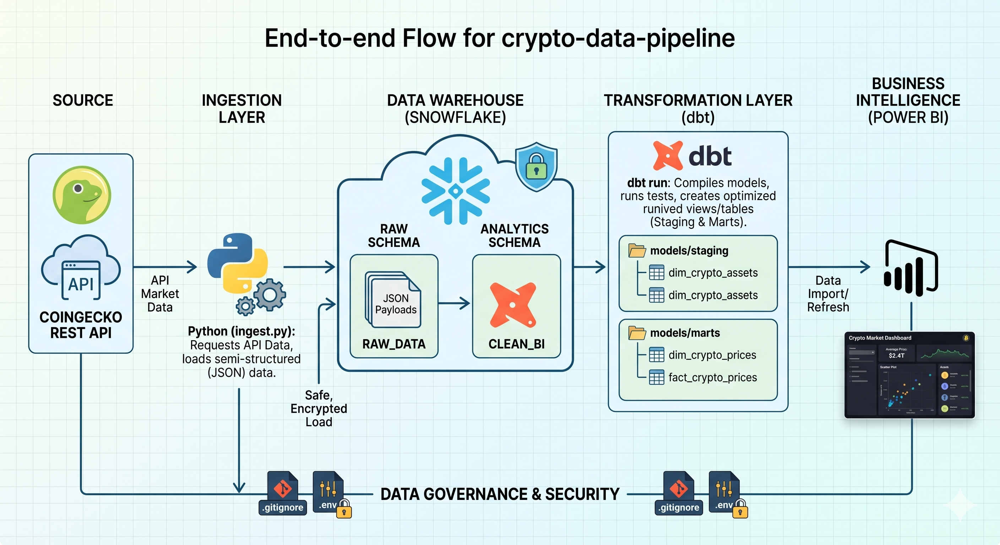
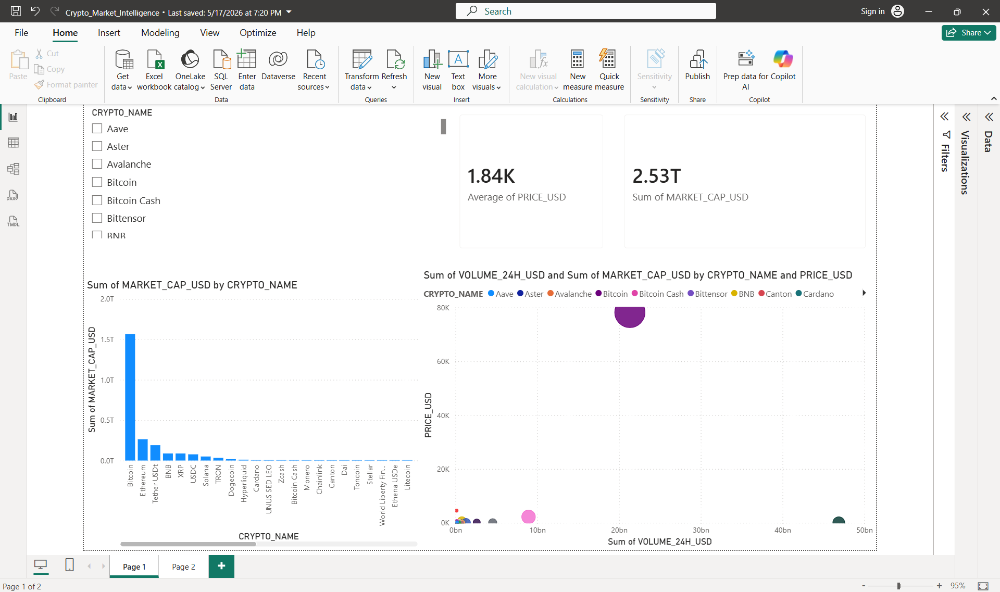

# 🪙 End-to-End Cryptocurrency Cloud Data Pipeline & BI Platform

An automated, cloud-native ELT data pipeline that extracts real-time market metrics for the top 50 cryptocurrencies via API, ingests them into a Snowflake Data Warehouse, transforms raw data into an optimized analytical Star Schema using dbt, and serves business-ready insights to an executive Power BI dashboard.

---

## 🏗️ System Architecture



The platform utilizes a decoupled ELT architecture to separate data ingestion from business transformation logic:
1. **Extraction Layer:** A Python 3.11 script queries the live CoinGecko REST API to fetch structured market dynamics.
2. **Raw Landing Layer:** Payloads are ingested into Snowflake (`RAW_MARKET_DATA`) as an immutable source of truth.
3. **Transformation Layer (dbt):** Type-casting, deduplication, and schema formatting take place across modular Staging and Marts layers.
4. **Presentation Layer:** Power BI connects directly to optimized analytical views over an active warehouse layer to render real-time executive analytics.

---

## 📁 Repository Structure

```text
📁 crypto-data-pipeline/
│
├── 📁 models/                  # dbt transformation layer
│   ├── 📁 staging/             # Source view definitions & type casting
│   │   ├── sources.yml
│   │   └── stg_crypto_data.sql
│   └── 📁 marts/               # Analytical Fact & Dimension tables
│       ├── dim_crypto_assests.sql
│       └── fact_crypto_prices.sql
│
├── .env.example                # Configuration template for local setup
├── .gitignore                  # Protection layer preventing credential leakage
├── Crypto_Market_Intelligence.pbix # Power BI Desktop visualization report
├── dbt_project.yml             # Core dbt configuration mapping
├── ingest.py                   # Python REST API ingestion engine
├── README.md                   # Project documentation manual
└── requirements.txt            # Python software dependencies ```

---

## 🛠️ Tech Stack & Prerequisites
* **Languages:** Python 3.11, SQL (Snowflake-dialect)
* **Cloud Platform:** Snowflake Data Warehouse
* **Data Transformation:** dbt Core (v1.7+)
* **BI Platform:** Microsoft Power BI Desktop

---

## 📊 Power BI Dashboard Executive Preview

Below is the live visual analytics layout serving automated intelligence data pulled straight from the optimized Snowflake analytical tables:


